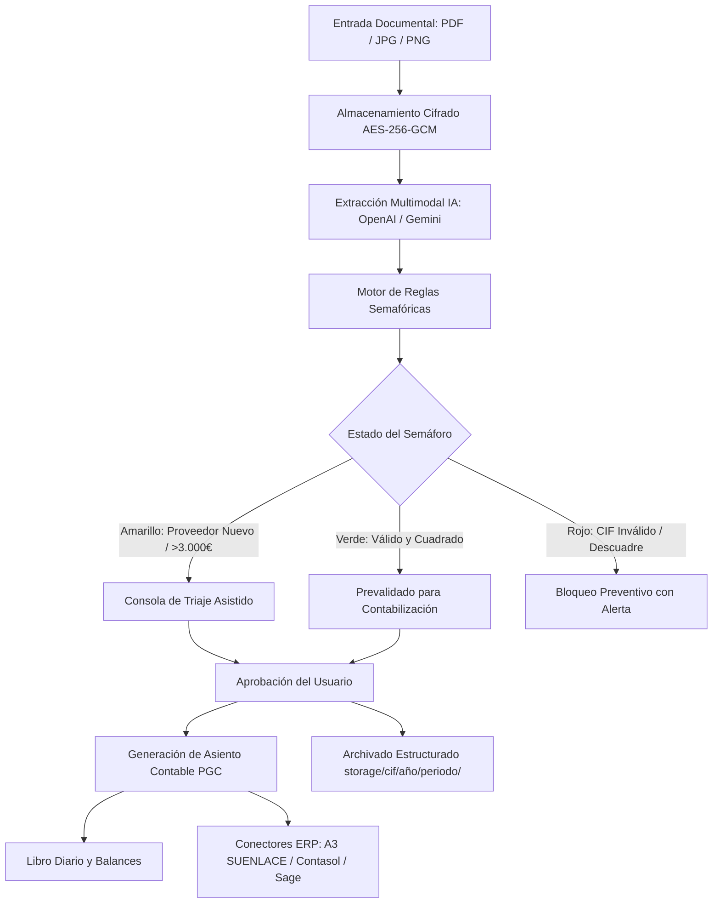

# ARQUITECTURA TÉCNICA DEL SISTEMA (ARCHITECTURE)
### Plataforma SaaS de Gestión Empresarial y Copiloto Contable con IA

---

## 1. Visión General y Paradigma Híbrido

La plataforma está diseñada con una arquitectura modular por dominios que permite operar en dos modalidades según la empresa cliente:
- **Modalidad A (ERP Completo):** Gestión integral de facturación emitida y recibida, contabilidad por partida doble, tesorería, modelos tributarios y custodia documental.
- **Modalidad B (Copiloto Contable Integrado):** La asesoría mantiene su software contable de cabecera (Wolters Kluwer A3, Software DELSOL Contasol, Sage 50/Despachos o Holded API). El sistema actúa como motor de pre-procesamiento, ingesta, triaje semafórico y generación de asientos, exportándolos periódicamente mediante conectores verificados.

---

## 2. Pila Tecnológica (Stack)

- **Backend:** FastAPI (Python 3.11+ / 3.14), Pydantic v2 para esquemas y validaciones estrictas.
- **Persistencia y ORM:** SQLAlchemy 2.0 (asíncrono con `aiosqlite` en desarrollo y arquitectura de conexión preparada para PostgreSQL con `asyncpg` en producción).
- **Procesamiento de Documentos:** PyMuPDF (`fitz`) para rasterizado de páginas a imágenes PNG de alta resolución (200 DPI), conteo de páginas y corte de documentos Multi-Factura (MF).
- **Inteligencia Artificial Multimodal:** OpenAI GPT-4o-mini con Structured Outputs (`beta.chat.completions.parse`) como motor predeterminado y fallback a Google Gemini 2.0 Flash (`google-genai`).
- **Seguridad en Reposo (Encryption at Rest):** AES-256-GCM con claves de 256 bits y vector de inicialización aleatorio para todos los archivos subidos.
- **Frontend:** Next.js 16 (App Router), React 19, TypeScript, TailwindCSS y Lucide Icons.

---

## 3. Modelo de Datos y Entidades Principales

1. **Company (`companies`):** Entidad multiempresa aislada. Contiene NIF/CIF único, razón social, longitud del plan contable (8, 9 o 10 dígitos), periodicidad de IVA (Trimestral/Mensual), régimen tributario y directorio de almacenamiento.
2. **Account (`accounts`):** Catálogo contable por empresa. Código de cuenta normalizado, descripción oficial y tipo (GASTO, INGRESO, PROVEEDOR, ACREEDOR, CLIENTE, FINANCIERO, TRIBUTARIO, INMOVILIZADO, PATRIMONIO).
3. **Supplier (`suppliers`):** Proveedores y acreedores homologados con sus subcuentas asignadas para autoaprendizaje.
4. **Invoice (`invoices`):** Facturas recibidas y tickets. Estado semafórico (GREEN, YELLOW, RED), workflow documental (`a_revisar`, `prevalidado`, `contabilizado`, `archivado`), hash SHA-256 para control de duplicados y desglose multi-IVA.
5. **InvoiceTaxBreakdown (`invoice_tax_breakdowns`):** Detalle de cada tramo impositivo (base, tipo % y cuota) vinculado en cascada.
6. **AccountingEntryLine (`accounting_entry_lines`):** Apuntes del Libro Diario en partida doble con subcuenta, concepto, Debe y Haber.
7. **CompanyIntegration (`company_integrations`):** Configuración de enlace con software contable externo (A3, Contasol, Sage, Holded).
8. **ExportBatch (`export_batches`):** Trazabilidad de lotes de exportación contable con control estricto de duplicidad.

---

## 4. Reglas Semafóricas y Validación Fiscal

El motor de reglas evalúa deterministamente los siguientes controles antes de asignar el color:

- **🟢 VERDE (Apto para contabilización):**
  - NIF/CIF válido según algoritmo oficial de la AEAT.
  - Cuadre aritmético exacto: `Total == Suma(Bases) + Suma(Cuotas IVA) - Retención IRPF (+ Recargo)`.
  - Proveedor ya registrado en el maestro con subcuentas contables asignadas y existentes en el Plan Contable.
  - Sin duplicados de hash ni número de factura para el mismo emisor en el ejercicio.
  - Periodo contable abierto.

- **🟡 AMARILLO (Revisión requerida):**
  - Proveedor nuevo (primera factura recibida): el sistema propone la subcuenta correlativa más próxima pero solicita confirmación.
  - Importe total superior a 3.000 € (alerta preventiva para el Modelo 347 anual).
  - La subcuenta propuesta no figura aún en el Plan Contable (se dará de alta al aprobar).

- **🔴 ROJO (Bloqueo preventivo):**
  - Descuadre matemático entre bases, impuestos y total.
  - CIF/NIF formalmente inválido según las especificaciones del Ministerio de Hacienda.
  - Factura duplicada detectada (mismo emisor, número y fecha o mismo hash de fichero).
  - Fecha de emisión perteneciente a un ejercicio contable cerrado.
  - Fallo en la extracción con IA o documento pendiente de revisión manual.
