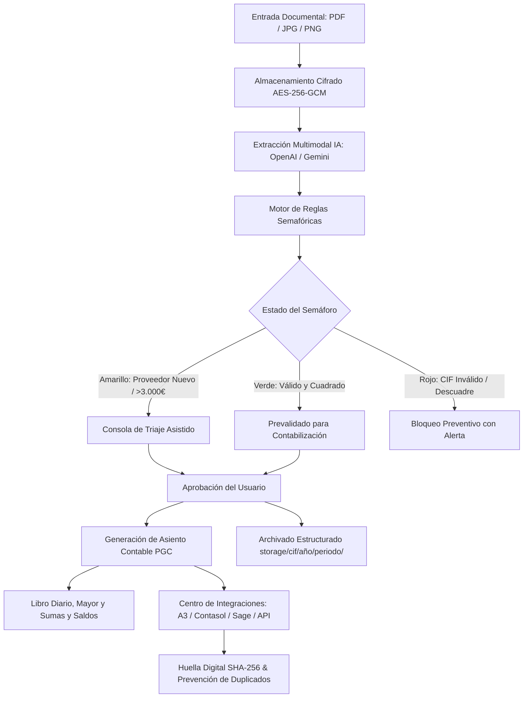

# ARQUITECTURA TÉCNICA DEL SISTEMA (ARCHITECTURE)
### Plataforma SaaS de Gestión Empresarial y Copiloto Contable con IA

---

## 1. Visión General y Paradigma Híbrido

La plataforma está diseñada con una arquitectura modular por dominios que permite operar en dos modalidades según la empresa cliente:
- **Modalidad A (ERP Completo):** Gestión integral de facturación emitida y recibida, contabilidad por partida doble, tesorería, modelos tributarios y custodia documental.
- **Modalidad B (Copiloto Contable Integrado):** La asesoría mantiene su software contable de cabecera (Wolters Kluwer A3, Software DELSOL Contasol, Sage 50/Despachos o Holded API). El sistema actúa como motor de pre-procesamiento, ingesta, triaje semafórico y generación de asientos, exportándolos periódicamente mediante conectores verificados.

---

## 2. Pila Tecnológica (Stack)

- **Backend:** FastAPI (Python 3.11+ / 3.14), Pydantic v2 para esquemas y validaciones estrictas.
- **Persistencia y ORM:** SQLAlchemy 2.0 (asíncrono con `aiosqlite` en SQLite local y preparado para PostgreSQL con `asyncpg` en producción).
- **Procesamiento de Documentos:** PyMuPDF (`fitz`) para rasterizado de páginas a imágenes PNG de alta resolución (200 DPI), conteo de páginas y corte de documentos Multi-Factura (MF).
- **Inteligencia Artificial Multimodal:** OpenAI GPT-4o-mini con Structured Outputs (`beta.chat.completions.parse`) como motor predeterminado y fallback a Google Gemini 2.0 Flash (`google-genai`), con conservación íntegra del archivo si la IA falla.
- **Seguridad en Reposo (Encryption at Rest):** AES-256-GCM con claves de 256 bits y vector de inicialización aleatorio para todos los archivos subidos.
- **Auditoría Criptográfica WORM:** `security_audit.log` con encadenamiento SHA-256 bloque a bloque (cumplimiento Art. 30/32 RGPD y Ley 11/2021).
- **Frontend:** Next.js 16 (App Router con Turbopack), React 19, TypeScript, TailwindCSS y Lucide Icons.

---

## 3. Modelo de Datos y Entidades Principales

1. **Company (`companies`):** Entidad multiempresa aislada. Contiene NIF/CIF único, razón social, longitud del plan contable (8, 9 o 10 dígitos), periodicidad de IVA (Trimestral/Mensual), régimen tributario, `fecha_cierre_contable` y directorio base de almacenamiento.
2. **Account (`accounts`):** Catálogo contable por empresa según PGC PYMES (RD 1515/2007). Código de cuenta normalizado, descripción oficial y saldos iniciales.
3. **Supplier (`suppliers`):** Proveedores y acreedores homologados con sus subcuentas asignadas para autoaprendizaje.
4. **Invoice (`invoices`):** Facturas recibidas y tickets. Estado semafórico (GREEN, YELLOW, RED), workflow documental (`a_revisar`, `prevalidado`, `contabilizado`, `archivado`), `file_hash` SHA-256 para control de duplicados y desglose multi-IVA.
5. **InvoiceTaxBreakdown (`invoice_tax_breakdowns`):** Detalle de cada tramo impositivo (base, tipo % y cuota) vinculado en cascada.
6. **AccountingEntryLine (`accounting_entry_lines`):** Apuntes del Libro Diario en partida doble con `subcuenta`, `concepto`, `debe`, `haber`, `status` (`borrador`, `contabilizado`, `revertido`), `is_reversal`, `reversal_of_entry_number` y `created_by`. Admite `invoice_id` nullable para asientos de ajuste, tesorería, regularización y apertura.
7. **CompanyIntegration (`company_integrations`):** Configuración de enlace con software contable externo (A3, Contasol, Sage, Holded API).
8. **ExportBatch (`export_batches`):** Trazabilidad de lotes de exportación contable con `data_fingerprint` (SHA-256), `fiscal_year`, `entries_count`, `invoices_count`, `file_format` y estados reales no simulados (`EXPORTED_FILE`, `SYNCED_API`, `PENDING_CREDENTIALS`, `FAILED`).

---

## 4. Arquitectura de Contabilidad General (Fase 2)

### 4.1. Libro Diario y Partida Doble
- **Cuadre Aritmético:** Todo asiento contabilizado cumple estrictamente:
  $$\sum \text{Debe} = \sum \text{Haber} \quad (\Delta < 0.01\,\text{€})$$
- **Paginación y Filtros:** Búsqueda por subcuenta, ejercicio fiscal, estado contable y exportación a nivel de servidor.
- **Trazabilidad:** Cada asiento mantiene enlace directo a su documento de origen (`Invoice` o `SalesInvoice`).

### 4.2. Libro Mayor Dinámico
- **Cálculo No Redundante:** El mayor se genera dinámicamente agregando los movimientos ordenados cronológicamente sin duplicar saldos en tablas auxiliares.
- **Naturaleza Contable:** Clasificación oficial según el PGC:
  - Cuentas de Activo y Gastos (Grupos 2, 3, 6): Naturaleza **Deudora**.
  - Cuentas de Pasivo e Ingresos (Grupos 1, 7): Naturaleza **Acreedora**.
  - Cuentas Comerciales y Financieras (Grupos 4, 5): Naturaleza **Mixta**.

### 4.3. Balance de Sumas y Saldos (Trial Balance)
- **Agregación Oficial por Grupos PGC:**
  - Grupo 1: Financiación Básica
  - Grupo 2: Activo No Corriente / Inmovilizado
  - Grupo 3: Existencias
  - Grupo 4: Acreedores y Deudores Comerciales
  - Grupo 5: Cuentas Financieras / Tesorería
  - Grupo 6: Compras y Gastos
  - Grupo 7: Ventas e Ingresos
- **Exportación:** Salida en CSV delimitado por `;` con codificación UTF-8 con BOM (`\ufeff`) y comas decimales para Microsoft Excel.

### 4.4. Ciclo de Vida, Inmutabilidad y Cierre
- **Inmutabilidad:** Los asientos contabilizados nunca se eliminan mediante `DELETE`.
- **Reversión Auditable:** Toda rectificación genera un contra-asiento invertido (Debe $\leftrightarrow$ Haber) con número correlativo libre y registro en la pista de auditoría.
- **Cierre de Ejercicio:** Regularización automática de grupos 6 y 7 contra la cuenta 129000000 (Resultado del Ejercicio) y fijación de `fecha_cierre_contable`.
- **Reapertura:** Requiere verificación estricta del CIF de la empresa para desbloquear el periodo.

---

## 5. Arquitectura del Centro de Integraciones (Fase 3)

### 5.1. Transparencia y Estados Reales
El sistema no simula integraciones:
- `EXPORTED_FILE`: Fichero de intercambio plano o CSV generado y listo para importar manualmente en el ERP instalado en local.
- `SYNCED_API`: Sincronización bidireccional confirmada con respuesta HTTP 200/201 del endpoint del proveedor Cloud.
- `PENDING_CREDENTIALS`: Conector seleccionado pero sin API Key configurada.
- `FAILED`: Error en la validación o generación del lote.

### 5.2. Prevención de Duplicados (Idempotencia Criptográfica)
- Para cada lote, se calcula un hash SHA-256 representativo (`data_fingerprint`) a partir de la lista ordenada de identificadores de factura e importes totales:
  $$\text{Fingerprint} = \text{SHA256}\left(\sum_i (\text{inv\_id}_i + \text{"\_"} + \text{total}_i)\right)$$
- Si un usuario intenta generar un lote con la misma huella, el sistema bloquea la operación con HTTP 400.
- Si la reexportación es legítima (p.ej. pérdida del fichero en el terminal del cliente), se exige `force_reexport=True` y un motivo formal (`reexport_reason`) de al menos 5 caracteres archivado en la auditoría.
